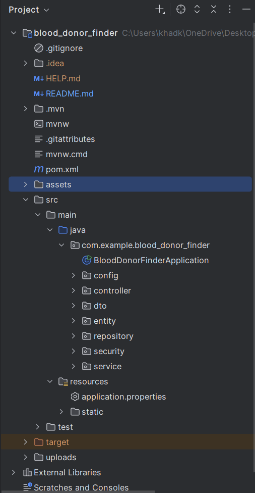
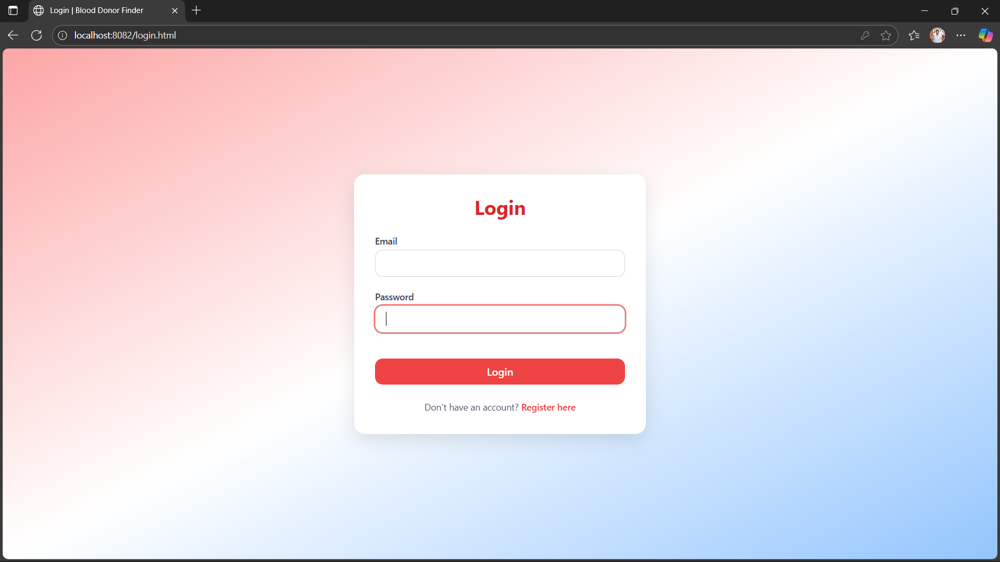
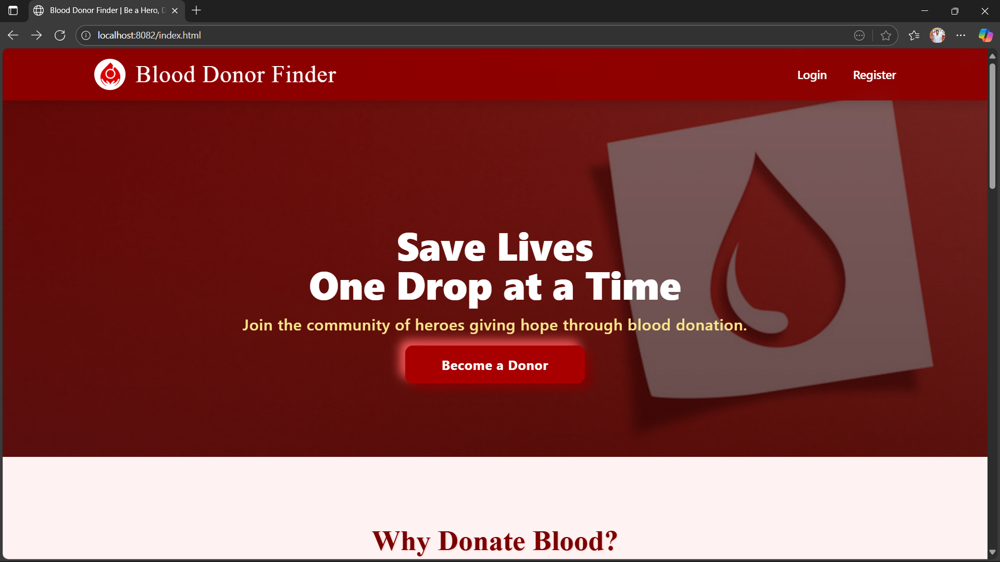
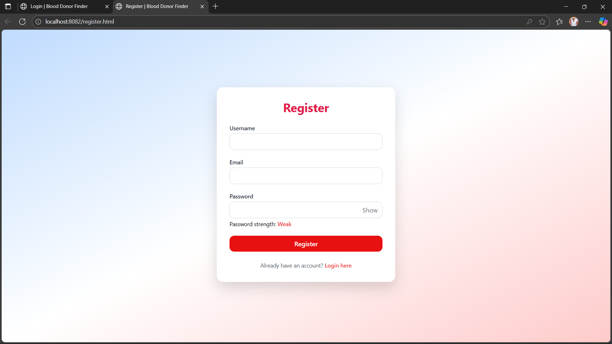
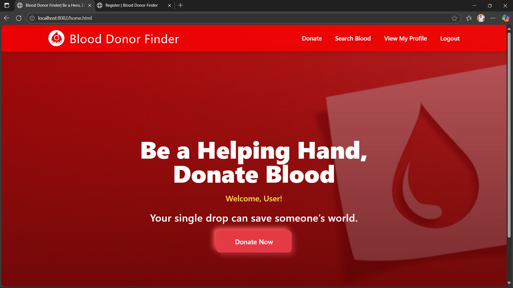
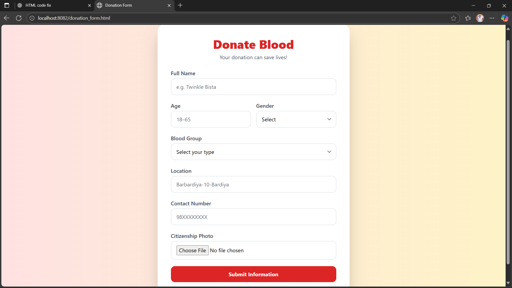
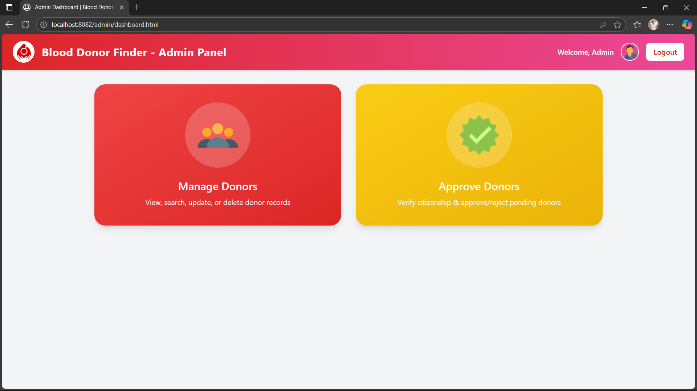

## 🩸 Blood Donor Finder
A web-based application to connect blood donors and recipients quickly and efficiently. 
This project aims to simplify the process of finding compatible blood donors in urgent 
situations by providing a centralized platform for registration, search, and management.

## 🚀 Features
i. 🔐 User Authentication – Secure login & registration using Session based authentication.

ii. 👤 Donor Registration – Donors can register with their details (name, blood group, location, contact info).

iii. 🔍 Search Functionality – Recipients can search donors by blood group & location.

iv. 📱 Responsive UI – Clean and user-friendly interface (HTML, Tailwind CSS).

v. 🛡 Backend Security – Protected APIs with Spring Boot.

vi. 💾 Database Integration – Donor and user data stored securely in MySQL.

## 🛠 Tech Stack
Frontend: HTML, Tailwind CSS
Backend: Java, Spring Boot
Database: MySQL
Authentication: Session based

## 📂 Project Structure

Here’s the structure of the Blood Donor Finder project:

## ⚙️ Installation & Setup
1. Clone the Repository
   git clone https://github.com/your-username/blood-donor-finder.git
   cd blood-donor-finder

2. Backend Setup
- Install Java (JDK 17+) and Maven.
- Navigate to the project folder (if not already there) and run the Spring Boot application:
     mvn spring-boot:run

3. Database Setup
- Install MySQL.
- Create a database:
 
CREATE DATABASE blood_donor_finder;

- Open backend/src/main/resources/application.properties and update your database username and password.
- Run the backend project; Spring Boot will automatically create the necessary tables.

4. Frontend Setup

 Open frontend/index.html in your browser.
 
## Screenshots

**LoginPage**

**IndexPage**

**Registration**

**HomePage**

**DonationForm**

**AdminPage**

**Database**

## 🔮 Future Improvements

i. Add email/SMS notifications for donor requests.

ii. Implement Google Maps API for donor location tracking.

iii. Mobile app integration (React Native / Flutter).

## 🤝 Contributing
Pull requests are welcome! For major changes, please open an issue first to discuss what you'd like to improve.